# Summarized Heatmap Vignette

## Introduction

Heatmaps are useful but can be difficult to customize appropriately. A
critical issue is verifying the alignment between the main body of the
heatmap and any marginal annotations and dendrograms.

The SummarizedExperiment class is designed to hold matrices together
with optional descriptive data for column and rownames. Validation
methods ensure these are always kept in order. The SummarizedHeatmap
class is a derivative of this class with similar validation methods.

The approach is to start with a matrix, typically with samples as
columns and genes or other features as rows. Values represent gene
counts, cell counts or some other numeric value. Then create a
SummarizedHeatmap object. Then add the desired colData and rowData to
supply data for annotations. Clustering occurs with the construction of
the SummarizedHeatmap object. A set of plotting functions is provided
for the main heatmap body, column and row annotations, dendrograms, and
highlights. The final heatmap is composed using *patchwork*.

## Constructing a SummarizedHeatmap

First obtain a matrix of values. The columns and rows should be named.

``` r
set.seed(123)
mat <- matrix(rnorm(100), ncol=5)
colnames(mat) <- letters[1:5]
rownames(mat) <- letters[6:25]
```

Next use the constructor function to generate the heatmap.

``` r
library(blaseRtools)
library(SummarizedExperiment)
library(patchwork)
my_heatmap <- SummarizedHeatmap(mat)
my_heatmap
#> class: SummarizedHeatmap 
#> dim: 20 5 
#> metadata(0):
#> assays(1): matrix
#> rownames(20): f g ... x y
#> rowData names(0):
#> colnames(5): a b c d e
#> colData names(0):
```

Add column and row metadata. Here we show a trivial example. Usually you
will want to extract this information from the same object that
generated the matrix. For example, a cell_data_set object.

``` r
colData(my_heatmap)$sample_type <- c("vowel", "consonant", "consonant", "consonant", "vowel")

isVowel <- function(char) char %in% c('a', 'e', 'i', 'o', 'u')
rowData(my_heatmap)$feature_type <- ifelse(isVowel(letters[6:25]), "vowel", "consonant")
```

Use the “getter” functions to extract the metadata and check to be sure
it was added correctly.

``` r
colData(my_heatmap)
#> DataFrame with 5 rows and 1 column
#>   sample_type
#>   <character>
#> a       vowel
#> b   consonant
#> c   consonant
#> d   consonant
#> e       vowel
rowData(my_heatmap)
#> DataFrame with 20 rows and 1 column
#>     feature_type
#>      <character>
#> f      consonant
#> g      consonant
#> h      consonant
#> i          vowel
#> j      consonant
#> ...          ...
#> u          vowel
#> v      consonant
#> w      consonant
#> x      consonant
#> y      consonant
```

For most cases, that is all you need to do. Variations are shown at the
end.

## Plotting

It is important to familiarize yourself with the *patchwork package* for
composing plots. It is very useful for putting together complex figures
and for compositing many panels into a single page for a publication or
grant.

The approach here is to plot each element individually and then compose
the elements into the final figure panel.

**Critical:** Although the SummarizedHeatmap object has validation
checks, the plotting functions do not. This means that you can
accidentally put the wrong dendrogram on a heatmap if you don’t check
your code. Always follow good practice when coding these objects. Best
practice is to wrap your plotting functions inside another function to
control the scope of your variables. This looks more complicated to
begin with but will become clear by the end.

### Plot the main heatmap body

A simple example:

``` r
my_heatmap_plot_function <- function(hm) {
  p1 <- bb_plot_heatmap_main(hm)
  p1
}
my_heatmap_plot_function(my_heatmap)
```

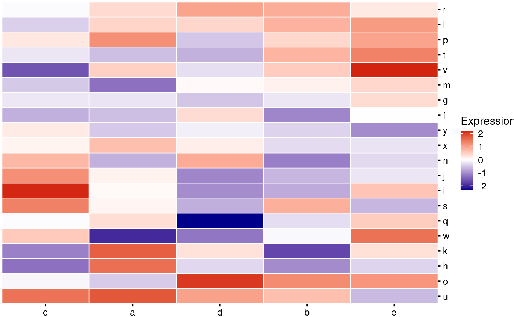

Change the color palette:

``` r
my_heatmap_plot_function <- function(hm) {
  p1 <- bb_plot_heatmap_main(hm, high = "purple", mid = "black", low = "yellow")
  p1
}
my_heatmap_plot_function(my_heatmap)
```

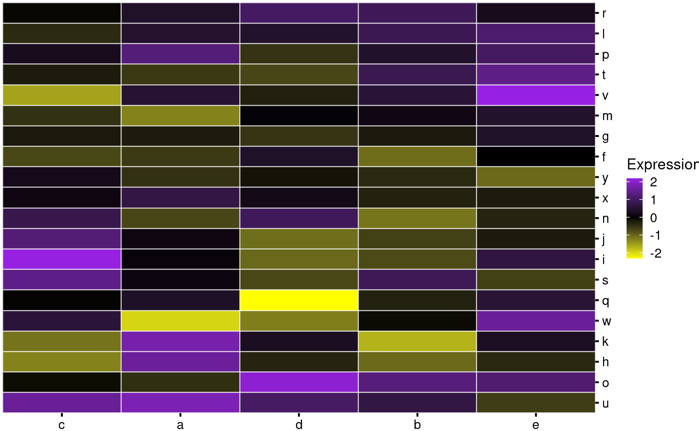

All plotting functions return ggplots, so if an internal parameter you
want to change is not available, you can do so by adding layers:

``` r
my_heatmap_plot_function <- function(hm) {
  p1 <- bb_plot_heatmap_main(hm) + 
    labs(fill = "Expr.") + 
    geom_tile(color = "black") + 
    theme(axis.text = element_blank(),
          axis.ticks = element_blank())
  p1
}
my_heatmap_plot_function(my_heatmap)
```

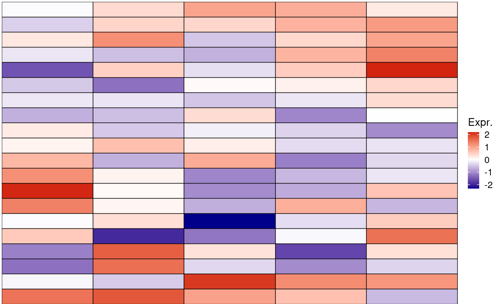

### Adding dendrograms

You make the column and row dendrograms using their own functions:

``` r
bb_plot_heatmap_colDendro(my_heatmap)
```


``` r
bb_plot_heatmap_rowDendro(my_heatmap)
```


These are not so useful on their own, so we can incoporate them into the
heatmap like this. Note how we are using the patchwork to make the
layout

``` r
my_heatmap_plot_function <- function(hm) {
  p1 <- bb_plot_heatmap_main(hm)
  p2 <- bb_plot_heatmap_colDendro(hm)
  p3 <- bb_plot_heatmap_rowDendro(hm)
  p4 <- guide_area()
  
  design <- "
  #2#
  314
  "
  p1 + p2 + p3 + p4 + plot_layout(design = design, 
                             guides = "collect",
                             widths = c(1, 8, 1), 
                             heights = c(1, 8))
}
my_heatmap_plot_function(my_heatmap)
```

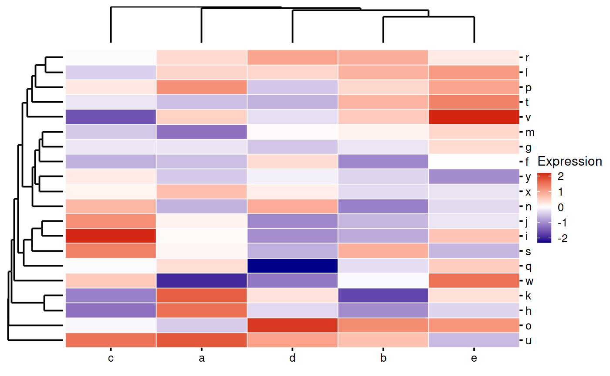

Currently the only aesthetic you can change for the dendrograms is
linewidth:

``` r
my_heatmap_plot_function <- function(hm) {
  p1 <- bb_plot_heatmap_main(hm)
  p2 <- bb_plot_heatmap_colDendro(hm, linewidth = 3)
  p3 <- bb_plot_heatmap_rowDendro(hm)
  p4 <- guide_area()
  
  design <- "
  #2#
  314
  "
  p1 + p2 + p3 + p4 + plot_layout(design = design, 
                             guides = "collect",
                             widths = c(1, 8, 1), 
                             heights = c(1, 8))
}
my_heatmap_plot_function(my_heatmap)
```

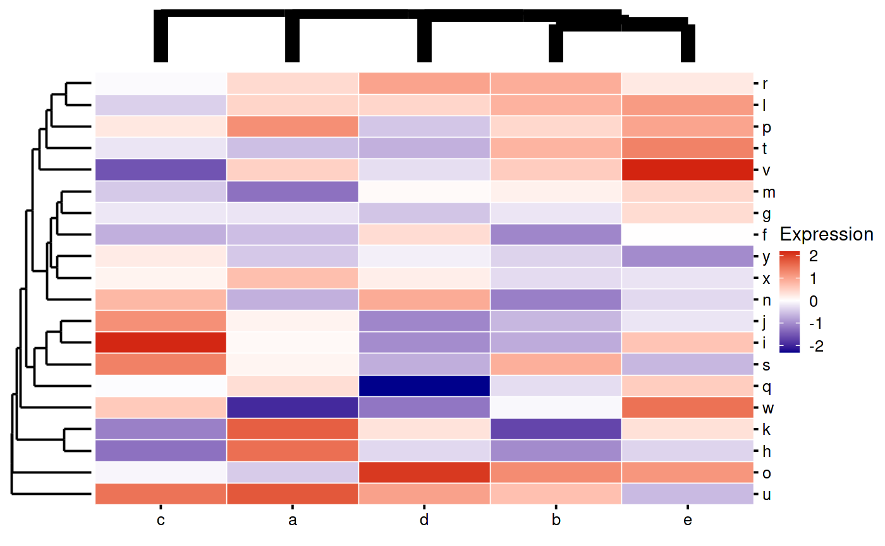

### Row and Column Annotations

Adding column annotations:

``` r
my_heatmap_plot_function <- function(hm) {
  p1 <- bb_plot_heatmap_main(hm)
  p2 <- bb_plot_heatmap_colDendro(hm)
  p3 <- bb_plot_heatmap_rowDendro(hm)
  p4 <- guide_area()
  p5 <- bb_plot_heatmap_colData(hm)
  
  
  design <- "
  #2#
  #54
  314
  "
  p1 + p2 + p3 + p4 + p5 + plot_layout(
    design = design,
    guides = "collect",
    widths = c(1, 8, 1),
    heights = c(1, 1, 8)
  )
}
my_heatmap_plot_function(my_heatmap)
```

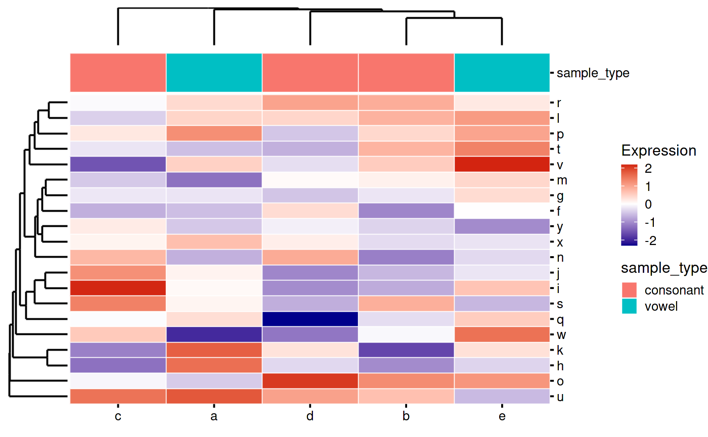 Adding
row annotations:

``` r
my_heatmap_plot_function <- function(hm) {
  p1 <- bb_plot_heatmap_main(hm)
  p2 <- bb_plot_heatmap_colDendro(hm)
  p3 <- bb_plot_heatmap_rowDendro(hm)
  p4 <- guide_area()
  p5 <- bb_plot_heatmap_rowData(hm)
  
  
  design <- "
  ##2#
  3514
  "
  p1 + p2 + p3 + p4 + p5 + plot_layout(
    design = design,
    guides = "collect",
    widths = c(1, 1, 8, 2),
    heights = c(1, 8)
  )
}
my_heatmap_plot_function(my_heatmap)
```

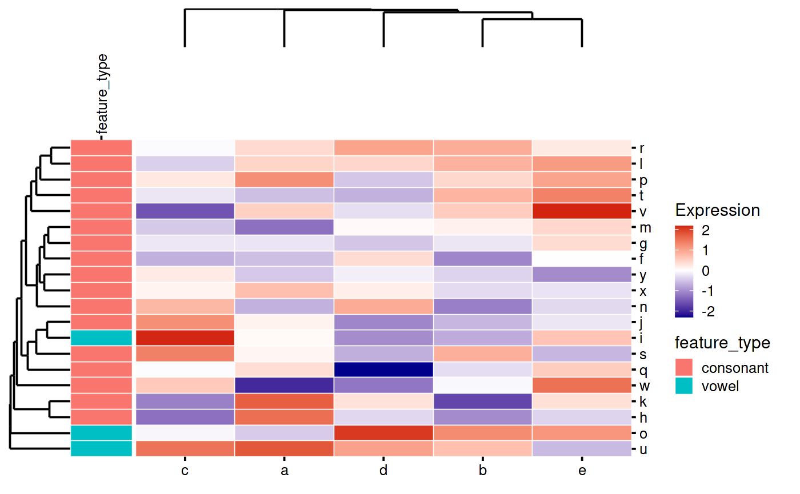

That looks weird because *patchwork* is leaving space for the
“feature_type” text. You can tell it to override this like so:

``` r
my_heatmap_plot_function <- function(hm) {
  p1 <- bb_plot_heatmap_main(hm)
  p2 <- bb_plot_heatmap_colDendro(hm)
  p3 <- bb_plot_heatmap_rowDendro(hm)
  p4 <- guide_area()
  p5 <- bb_plot_heatmap_rowData(hm)
  
  
  design <- "
  ##2#
  3514
  "
  p1 + p2 + p3 + p4 + free(p5, side = "t", type = "space") + plot_layout(
    design = design,
    guides = "collect",
    widths = c(1, 1, 8, 2),
    heights = c(2, 8)
  )
}
my_heatmap_plot_function(my_heatmap)
```

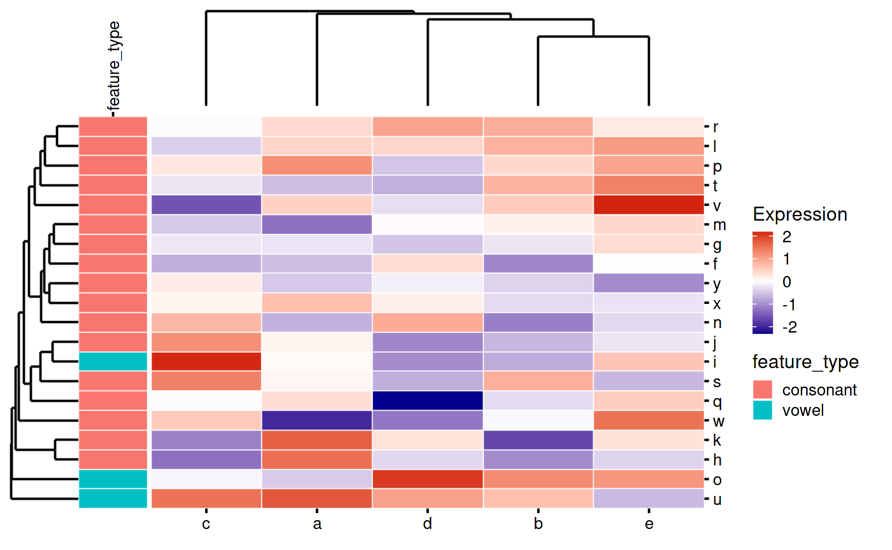

You can also move the annotation text to the other side:

``` r
my_heatmap_plot_function <- function(hm) {
  p1 <- bb_plot_heatmap_main(hm)
  p2 <- bb_plot_heatmap_colDendro(hm)
  p3 <- bb_plot_heatmap_rowDendro(hm)
  p4 <- guide_area()
  p5 <- bb_plot_heatmap_rowData(hm) + 
    scale_x_discrete() + 
    theme(axis.text.x = element_text(angle = 90, vjust = 0.5))
  
  
  design <- "
  ##2#
  3514
  "
  p1 + p2 + p3 + p4 + p5 + plot_layout(
    design = design,
    guides = "collect",
    widths = c(1, 1, 8, 2),
    heights = c(2, 8)
  )
}
my_heatmap_plot_function(my_heatmap)
```

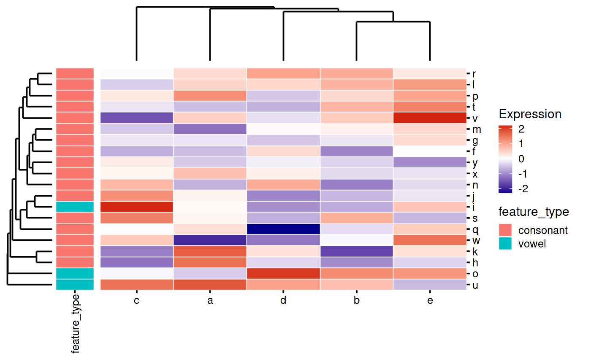

You can add row and column annotations together:

``` r
my_heatmap_plot_function <- function(hm) {
  p1 <- bb_plot_heatmap_main(hm)
  p2 <- bb_plot_heatmap_colDendro(hm)
  p3 <- bb_plot_heatmap_rowDendro(hm)
  p4 <- guide_area()
  p5 <- bb_plot_heatmap_colData(hm)
  p6 <- bb_plot_heatmap_rowData(hm)
  
  design <- "
  ##2#
  ##54
  3614
  "
  p1 + p2 + p3 + p4 + p5 + free(p6, side = "t", type = "space") + plot_layout(
    design = design,
    guides = "collect",
    widths = c(1, 1, 8, 1),
    heights = c(1, 1, 8)
  )
}
my_heatmap_plot_function(my_heatmap)
```

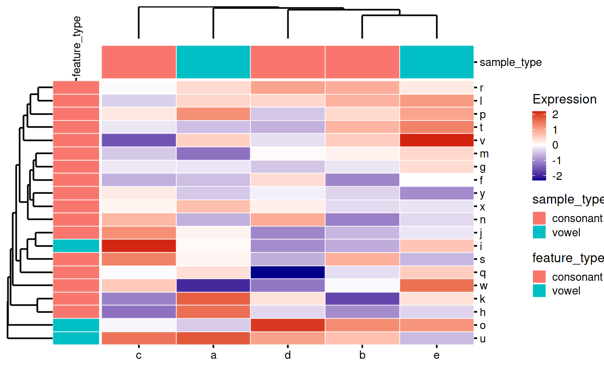

### Heatmap Highlights

Sometimes you have too many rows or columns on your plot and you want to
cherry pick a few to show your reader.

1.  Remove the axis text using ggplot layers
2.  Add a new plot with the highlights to the patchwork:

``` r
my_heatmap_plot_function <- function(hm) {
  p1 <- bb_plot_heatmap_main(hm) + 
    theme(axis.text.y = element_blank(),
          axis.ticks.y = element_blank())
  p2 <- bb_plot_heatmap_colDendro(hm)
  p3 <- bb_plot_heatmap_rowDendro(hm)
  p4 <- guide_area()
  p5 <- bb_plot_heatmap_colData(hm)
  p6 <- bb_plot_heatmap_rowData(hm)
  p7 <- bb_plot_heatmap_rowHighlight(hm, highlights = c("l", "m", "n"))
  
  design <- "
  ##2##
  ##5#4
  36174
  "
  p1 + 
    p2 + 
    p3 + 
    p4 + 
    free(p5, side = "r", type = "space") + 
    free(p6, side = "t", type = "space") + 
    p7 + 
    plot_layout(
    design = design,
    guides = "collect",
    widths = c(1, 1, 8, 1, 2),
    heights = c(1, 1, 8)
  )
}
my_heatmap_plot_function(my_heatmap)
```

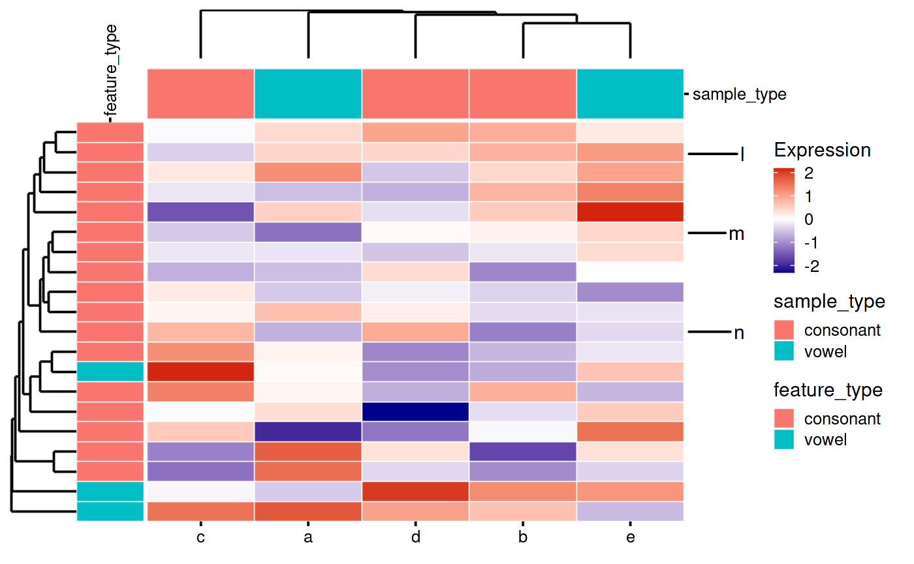

## Customization

Here is another example with more customizations.

1.  Custom color palettes for annotations
2.  Selecting which annotations to show
3.  Renaming the labels for annotations

``` r
mat <- matrix(rnorm(100), ncol = 5)

sample_data <- tibble(
  the_letters = letters[1:5],
  sample_type = c("vowel", "consonant", "consonant", "consonant", "vowel"),
  sample_type2 = c("vowel2", "consonant2", "consonant2", "consonant2", "vowel2")
)
isVowel <- function(char)
  char %in% c('a', 'e', 'i', 'o', 'u')
feature_data <- tibble(
  the_letters = letters[6:25],
  feature_type = ifelse(isVowel(the_letters), "vowel", "consonant"),
  feature_type2  = paste0(feature_type, "2")
)

colnames(mat) <- sample_data$the_letters
rownames(mat) <- feature_data$the_letters

my_custom_heatmap <- SummarizedHeatmap(mat)

colData(my_custom_heatmap) <-
  DataFrame(sample_data, row.names = sample_data$the_letters)
rowData(my_custom_heatmap) <-
  DataFrame(feature_data, row.names = feature_data$the_letters)

my_custom_heatmap_plotting_function <- function(hm) {
  p1 <- bb_plot_heatmap_colDendro(hm)
  p2 <- bb_plot_heatmap_rowDendro(hm, side = "left")
  p3 <- bb_plot_heatmap_colData(
    hm,
    vars = c("Sample Type" = "sample_type", 
             "Sample Type 2" = "sample_type2"),
    manual_pal = c(
      "consonant" = "ivory",
      "vowel" = "pink",
      "consonant2" = "cornsilk",
      "vowel2" = "pink3"
    )
  )
  p4 <- bb_plot_heatmap_rowData(
    hm,
    vars = c("Feature Type" = "feature_type",
             "Feature Type2" = "feature_type2"),
    manual_pal = c(
      "consonant" = "ivory3",
      "vowel" = "pink4",
      "consonant2" = "bisque1",
      "vowel2" = "lightpink3"
    )
  )
  
  
  p5 <- bb_plot_heatmap_main(hm, tile_color = "white")
  
  p6 <- guide_area()
  design <- "
##1#
##36
2456

"
p1 + 
  p2 + 
  free(p3, side = "r",  type = "space") + 
  free(p4, side = "t", type = "space") + 
  p5 + 
  p6 + 
  plot_layout(
  design = design,
  widths = c(.1, .2, 1, 0.5),
  heights = c(.1, .2, 1),
  guides = "collect"
)

}

my_custom_heatmap_plotting_function(my_custom_heatmap)
```

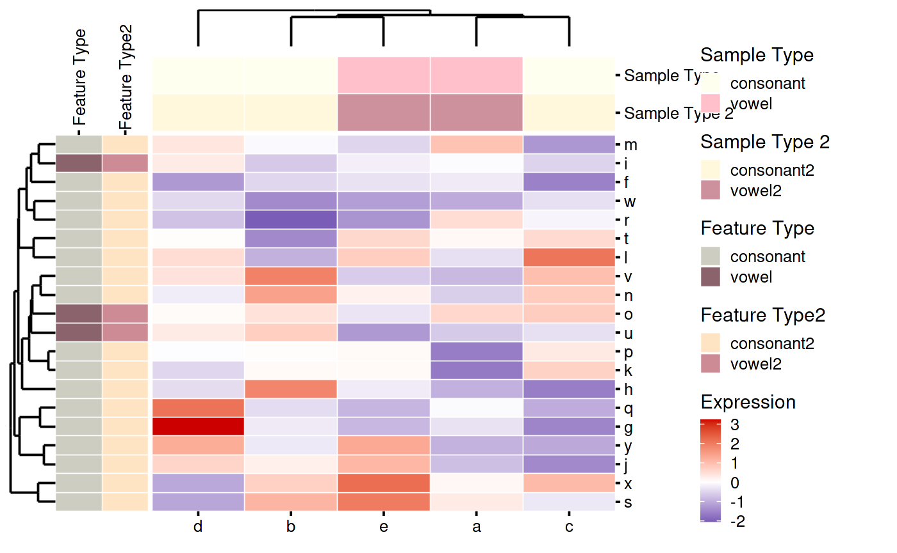

## Other variations

### Transposing the plot

By convention we normally put samples as columns and features as rows.
This is not strictly enforced by the object. So it is possible to
transpose the matrix and swap the colData/rowData when making the
SummarizedHeatmap object. Another option is to flip the heatmap and all
of the annotations. You do this by flipping the main heatmap body and
setting the sides of the annotations and dendrograms the way you like.
(You can also use this to put the annotations on any side, whether or
not you flip the main heatmap).

``` r
my_flipped_heatmap_plot_function <- function(hm) {
  p1 <- bb_plot_heatmap_main(hm, flip = TRUE)
  p2 <- bb_plot_heatmap_colDendro(hm, side = "left")
  p3 <- bb_plot_heatmap_colData(hm, side = "left")
  p4 <- bb_plot_heatmap_rowDendro(hm, side = "top")
  p5 <- bb_plot_heatmap_rowData(hm, side = "top")
  p6 <- guide_area()
  p7 <-
    bb_plot_heatmap_colHighlight(hm,
                                 highlights = c("a", "b", "c"),
                                 side = "right")
  p8 <-
    bb_plot_heatmap_rowHighlight(hm,
                                 highlights = c("w", "s", "v"),
                                 side = "bottom")
  
  design <- "
##4#6
##5#6
23176
##8##
"

p1 + 
  p2 + 
  free(p3, side = "t", type = "space") + 
  p4 + 
  free(p5, side = "r", type = "space") + 
  p6 + 
  p7 + 
  p8 + 
  plot_layout(
    design = design, 
    guides = "collect")
}
my_flipped_heatmap_plot_function(my_heatmap)
```

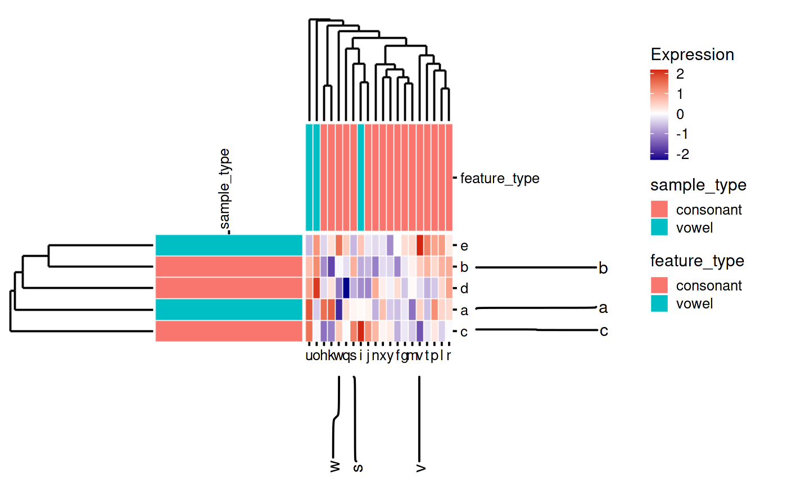

### Manual ordering

Usually clustering rows and columns produces a more interpretable
figure, but on rare occasions you may wish to manually establish the
order of columns or rows.

To do this, provide a character vector corresponding to this order to
the constructor function. Note that you cannot manually specify
row/column order and retain a dendrogram for that dimension.

``` r
set.seed(123)
mat <- matrix(rnorm(100), ncol = 5)
colnames(mat) <- letters[1:5]
rownames(mat) <- letters[6:25]

my_ordered_heatmap <-
  SummarizedHeatmap(mat, colOrder = letters[1:5])
colData(my_ordered_heatmap) <-
  DataFrame(sample_data, row.names = sample_data$the_letters)
rowData(my_ordered_heatmap) <-
  DataFrame(feature_data, row.names = feature_data$the_letters)
# set col order
my_ordered_heatmap_plot_function <- function(hm) {
  p1 <- bb_plot_heatmap_main(hm)
  p2 <- plot_spacer()
  p3 <- bb_plot_heatmap_colData(hm, vars = c("sample_type"))
  p4 <- bb_plot_heatmap_rowDendro(hm)
  p5 <- bb_plot_heatmap_rowData(hm, vars = c("feature_type"))
  p6 <- guide_area()
  
  design <- "
##2#
##36
4516
"
p1 + 
  p2 + 
  free(p3, side = "r", type = "space") + 
  p4 + 
  free(p5, side = "t", type = "space") + 
  p6 + 
  plot_layout(design = design, 
              guides = "collect", 
              heights = c(1, 1, 8),
              widths = c(1, 1, 8, 2))
}
my_ordered_heatmap_plot_function(my_ordered_heatmap)
```

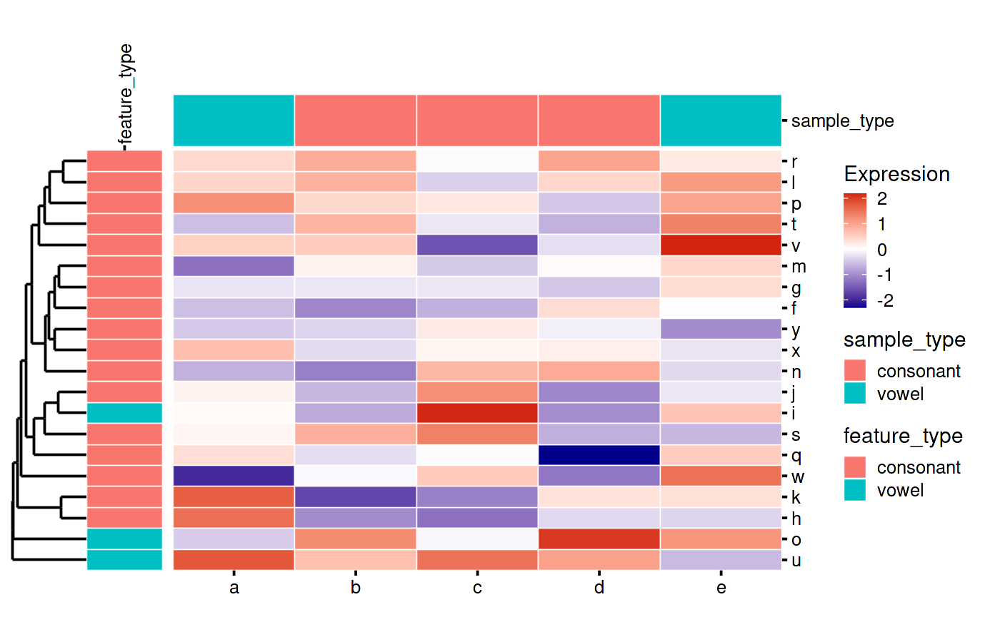
